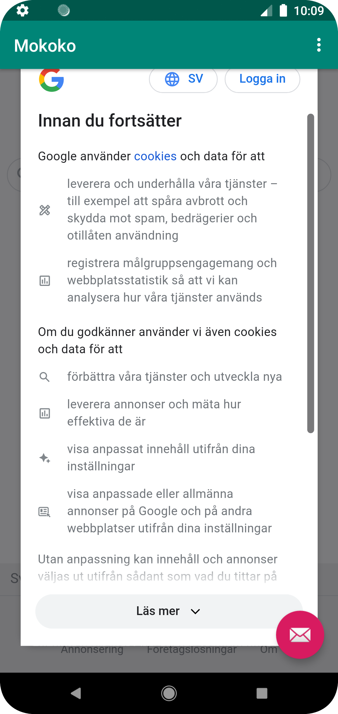
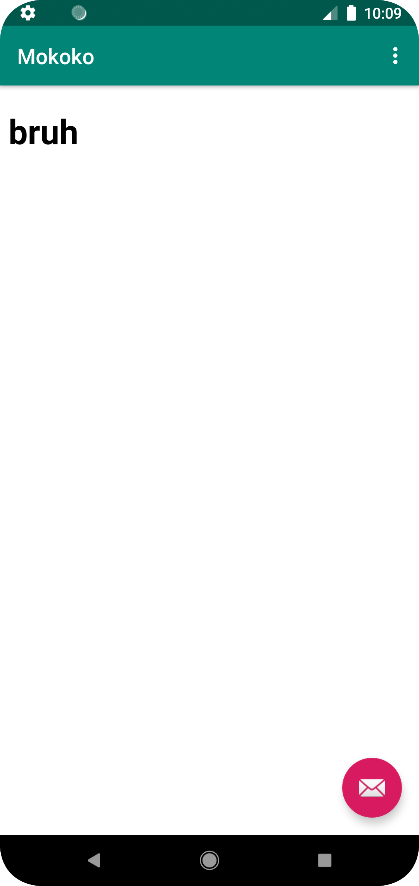

# Rapport

Arbetet har gått smidigt och följt de instruktioner som tilldelats inuti "MainActivity.java". En del commits och pushar har gjorts under lite andra delar
än de instruktionerna visar.

Nedan följer de delar av koden som har förändrats och de metoder de ligger inuti.
```
protected void onCreate(Bundle savedInstanceState) {
        myWebView = findViewById(R.id.my_webview);
        myWebView.getSettings().setJavaScriptEnabled(true);
        WebViewClient webViewClient = new WebViewClient();
        myWebView.setWebViewClient(webViewClient);
}
public boolean onOptionsItemSelected(MenuItem item) {
 if (id == R.id.action_external_web) {
            showExternalWebPage();
            Log.d("==>","Will display external web page");
            return true;
        }

        if (id == R.id.action_internal_web) {
            showInternalWebPage();
            Log.d("==>","Will display internal web page");
            return true;
        }
 }

 <WebView
         android:layout_width="match_parent"
         android:layout_height="match_parent"
         android:id="@+id/my_webview"
         />

 <!DOCTYPE html>
 <html lang="en">
 <head>
     <meta charset="UTF-8"/>
     <title>Mokoko Test</title>
 </head>
 <body>
 <h1>bruh</h1>
 <h1>bruh</h1>
 </body>
 </html>
```





